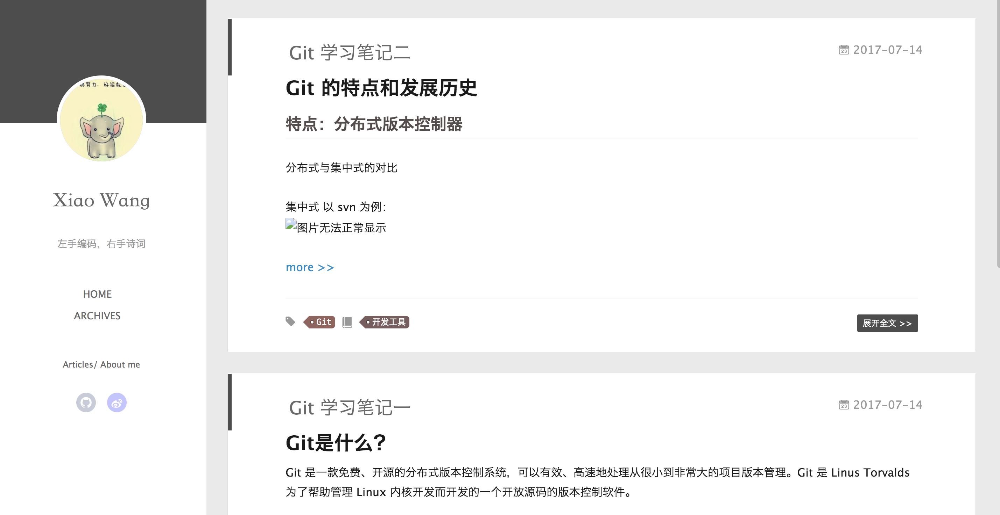
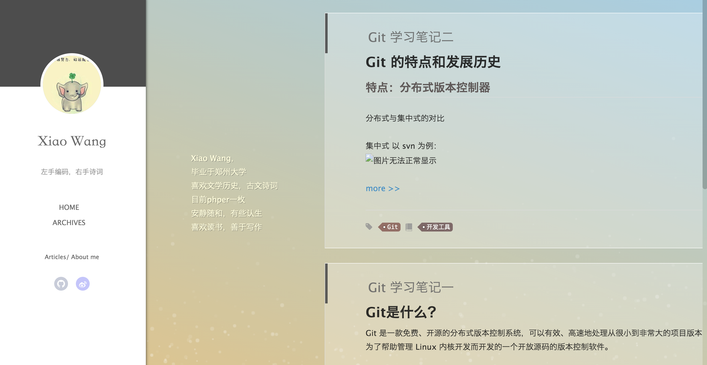

# hexo-yilia

一个基于 Yilia 主题改进的 Hexo 博客。

```bash
# 安装 Git、Node.js、Hexo

$ git clone git@github.com:wangwei664/hexo-yilia.git # 克隆源码
$ cd hexo-yilia # 进入项目目录
$ npm install # 安装依赖

$ hexo g # 生成静态页面
$ hexo s # 启动本地服务器预览

# 浏览器访问本地启动的预览地址

$ hexo d # 部署项目
```

  

